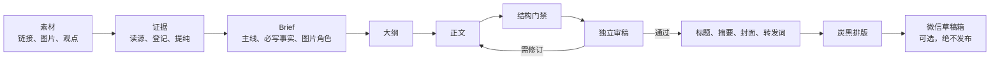

<p align="center">
  
</p>

# FlexFox 公众号写作系统

把一堆链接、截图和零散想法，做成一篇能审、能排、能进公众号草稿箱的文章。

它不是“丢素材，一次出终稿”的提示词。FlexFox 把容易跑偏的地方拆开：先核事实，再定主线，写完由独立审稿检查，最后才排版和投递。文章可以像你的账号，事实不能像你的想象。

适用于任何能读取本地文件、执行命令、生成或读取图片的 AI；不绑定 Codex、Claude 或 Gemini。

## 它能干什么

| 你给什么 | FlexFox 做什么 | 留下什么 |
| --- | --- | --- |
| 一条或多条公众号 / X 链接 | 抓取、登记成功与失败来源，提炼可核验事实 | `过程/来源/`、`过程/evidence.md` |
| 一个热点、观点或产品 | 判断文章是否值得写，定读者、主线、必写事实与图片角色 | `过程/brief.md`、`过程/outline.md` |
| 已确认的主线 | 写 2,200–3,000 字公众号长文，带短小标题、证据图与固定 CTA | `article.md`、`images/` |
| 一篇初稿 | 检查结构、事实归属、漏写素材、AI 套话与假实测 | `过程/review.md`、`过程/review.json` |
| 终审标题 | 生成摘要、固定槽位转发词、900×383 黑白封面与炭黑商务排版 | `digest.md`、`转发词.md`、封面、排版稿 |
| 公众号开发配置（可选） | 上传本地图片并创建一篇草稿 | `过程/wechat-draft.json` |

它**不会**发布、群发或删除草稿；没有读取到的来源、没有证据的体验、无法确认的数字，都不能被写成事实。

## 你要做什么

只需要做四件事：

1. 给素材：链接、截图、核心观点，或者一句“我想写这个”。
2. 选模式：默认 `guided`，AI 做完 Brief 会等你确认；你已经给出清晰主线时才用 `auto`。
3. 写一次账号配置：你的读者、口吻、禁语、CTA、封面和排版偏好。
4. 想进草稿箱时，再填本机微信配置；不填也能完整产出文章和排版稿。

你不需要手动管理“标题 Agent、写作 Agent、审稿 Agent”。这些是同一条流水线里的角色边界，不是一堆需要你盯着的机器人。

## 快速开始

### 1. 获取并检查

```bash
git clone https://github.com/ZMKC808/flexfox-wechat-writing-system.git
cd flexfox-wechat-writing-system
bash scripts/validate.sh
```

需要 Python 3.9+；`validate.sh` 需要 [uv](https://docs.astral.sh/uv/)。不运行校验也可以先让 AI 按 `AGENTS.md` 写稿。

### 2. 配置你的账号

```bash
cp assets/profile-template.md flexfox-profile.md
```

填写 `flexfox-profile.md`。它是公开、可替换的账号配置。想让风格真正稳定，再在本机建立私有风格包：

```text
flexfox-profile-private/
├── style-guide.md      # 常用写法、边界、人工修改经验
└── corpus/             # 5–10 篇黄金样本；完整旧稿可另作私有归档
```

这个目录默认不进 Git。每次写稿只读同类型的 2–3 篇，不能整库模仿。已有旧 SOP 的账号，按[迁移说明](references/legacy-migration.md)搬规则和样本，不搬历史过程文件和抓取素材。

### 3. 把这段话交给 AI

```text
工作区：/你的/flexfox-wechat-writing-system
请先读 AGENTS.md，按 FlexFox 流水线完成一篇公众号文章。
模式：guided
素材：
【粘贴链接、图片说明和核心想法】
```

这就是日常入口。没有链接时，直接给想写的事也可以。

## 完整工作流



| 阶段 | AI 的职责 | 人是否需要介入 |
| --- | --- | --- |
| 证据 | 读取每条来源，标记事实、判断与无法核验内容 | 只在来源读不到或版权边界不清时 |
| Brief | 选择文章原型、读者问题、主线、必写事实和配图计划 | `guided` 模式下确认方向；`auto` 跳过此停顿 |
| 正文 | 按大纲写作；短句有节奏，但不一句一行 | 不需要 |
| 审稿 | 审稿者不改正文，只记录问题；作者只做定点修复，再二审 | 第二轮仍有重大问题时 |
| 交付 | 生成标题、摘要、封面、转发词、排版稿 | 草稿箱投递前需已配置公众号 |

结构门禁会检查字数、小标题、语义块、图片间隔、重复图、必写事实和审稿回执。它只拦截明确错误；“好不好看、像不像你”仍由 Profile、黄金样本和独立审稿负责。

## 可选：创建公众号草稿

先复制配置模板，不要把真实密钥提交到仓库：

```bash
cp assets/wechat-account.example.env config/wechat.local.env
```

填写 AppID、AppSecret 与可选署名后，验证凭据：

```bash
uv run --with requests python3 scripts/wechat_draft.py validate
```

只有 `pipeline.py preflight` 通过，才允许创建草稿：

```bash
uv run --with requests python3 scripts/wechat_draft.py draft \
  --article-dir articles/YYYY-MM-DD-主题 \
  --title "终审标题" \
  --confirm-draft
```

脚本会把正文使用的本地图片上传到微信 CDN，再创建一篇草稿并回读结果。它没有发布、群发或清稿接口。

## 产物长什么样

```text
articles/YYYY-MM-DD-主题/
├── article.md          # 唯一正文母本
├── 转发词.md            # 固定槽位替换后的转发文案
├── images/             # 证据图、封面、图片清单
└── 过程/               # 来源、Brief、大纲、审稿、排版与投递回执
```

平时你只需要打开 `article.md`、`转发词.md` 和 `images/`。其余文件是为了让 AI 能复查、返工和交接，不占你的日常视线。

## 仓库怎么分层

```text
skills/       # 可插拔能力：研究、二创、写作、审稿、标题、封面、排版、草稿箱
references/   # 各能力共享的合同，不写账号私密内容
scripts/      # 抓取、门禁、排版、微信投递等确定性动作
profiles/     # 可替换示例账号；私有账号资产由 .gitignore 保护
assets/       # Profile 与配置模板
```

默认 Profile 是 AI飞升录的公开版。其他人使用时只需替换 `flexfox-profile.md`；不需要复制你的历史文章、图片、密钥或本机 Skill。
